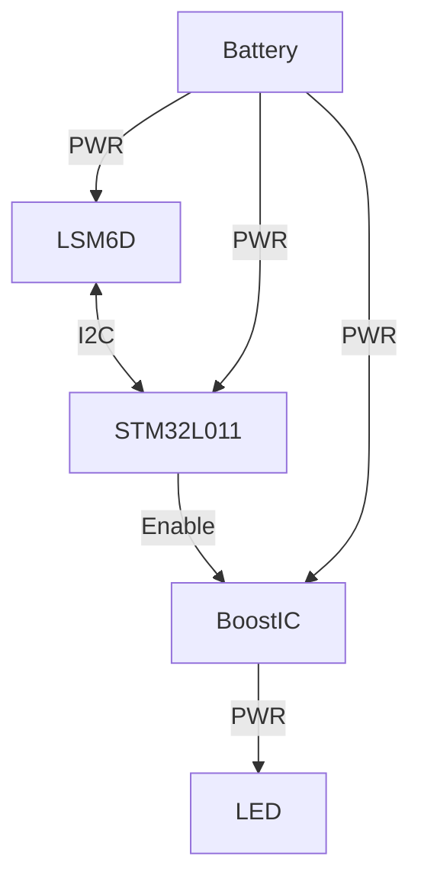

# About the produce

---
*Version V 0.1 | April 21*
A candle without fire.
This product uses STM32L011 serice and LSM6D serice to process action and logic, and uses CR2450 for Power supply.
This product takes into account a lot of LowPowerConsumption design to make the battery last longer.

## What does it work

### Hardware Part

## Version Introduction

### *Version V 0.1 | April 12*

This test version of the hardware design mainly verified

- the power consumption of the STM32L011 and the warm white LED,
- the minimum voltage of the STM32L011, the LSM6D and the WarmWhite LED,
- the Bettary characteristics of CR2450 with high current,

Identifies many problems in the design,
also find many problems should be fixed in the workflow.

By the way this test version CANNOT use in too many errors.
