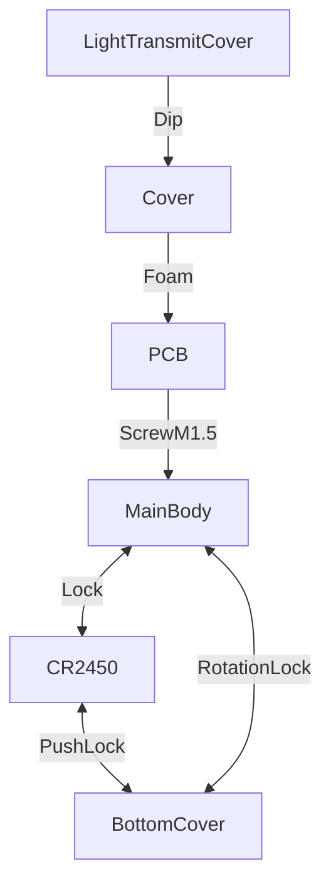

# About the Shell

**Version V 0.1 | May the 4th be with you**

The Shell is made for the E-Candle project.

There are four parts, the LightTransmitCover, the Cover, the MainBody and the BottonCover.

This shell is used to hold the PCB and lets the LEDLight to shine through.

This design takes into account about

- the waterproof ability of the struture.
- how to lock the CR2450, not too tight and easy to replace it.

## What does it work

## Version Introduction

**Version V 0.1 | May the 4th be with you**

This test version of the shell design mainly verified

- the installation method of the RotationLock, which is based on the XiaomiThermometerHygrometer3, used for the MainBody and BottomCover.
- the installation method of the ClipLock which is based on the XiaomiThermometerHygrometer3, used for the MainBody and the BatteryCR2450.
- there is a mounting slot for a waterproof rubber ring at the bottom of the Mainbody.

All parts have been sent to the factory and it is producting.
